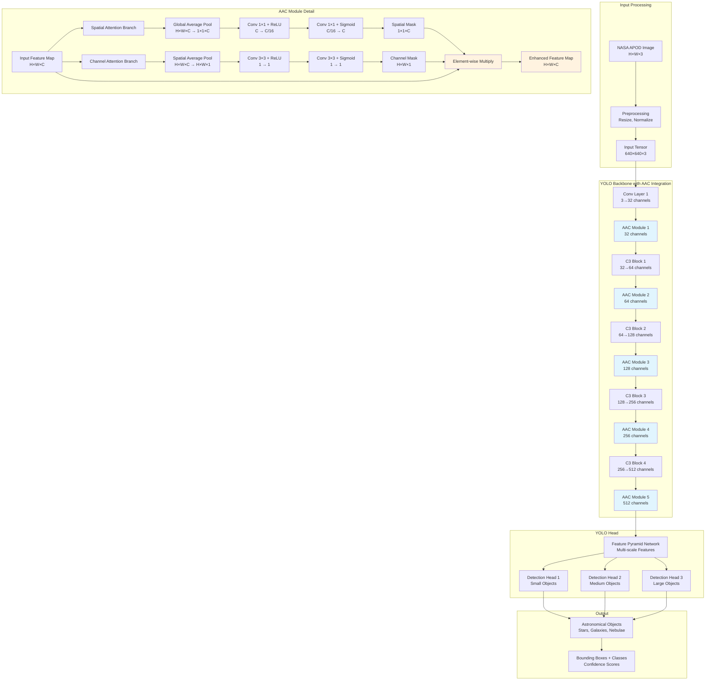

```mermaid
graph TB
    subgraph "Input Processing"
        A[NASA APOD Image<br/>H×W×3] --> B[Preprocessing<br/>Resize, Normalize]
        B --> C[Input Tensor<br/>640×640×3]
    end
    
    subgraph "YOLO Backbone with AAC Integration"
        C --> D[Conv Layer 1<br/>3→32 channels]
        D --> E[AAC Module 1<br/>32 channels]
        E --> F[C3 Block 1<br/>32→64 channels]
        F --> G[AAC Module 2<br/>64 channels]
        G --> H[C3 Block 2<br/>64→128 channels]
        H --> I[AAC Module 3<br/>128 channels]
        I --> J[C3 Block 3<br/>128→256 channels]
        J --> K[AAC Module 4<br/>256 channels]
        K --> L[C3 Block 4<br/>256→512 channels]
        L --> M[AAC Module 5<br/>512 channels]
    end
    
    subgraph "AAC Module Detail"
        N[Input Feature Map<br/>H×W×C] --> O[Spatial Attention Branch]
        N --> P[Channel Attention Branch]
        
        O --> Q[Global Average Pool<br/>H×W×C → 1×1×C]
        Q --> R[Conv 1×1 + ReLU<br/>C → C/16]
        R --> S[Conv 1×1 + Sigmoid<br/>C/16 → C]
        S --> T[Spatial Mask<br/>1×1×C]
        
        P --> U[Spatial Average Pool<br/>H×W×C → H×W×1]
        U --> V[Conv 3×3 + ReLU<br/>1 → 1]
        V --> W[Conv 3×3 + Sigmoid<br/>1 → 1]
        W --> X[Channel Mask<br/>H×W×1]
        
        T --> Y[Element-wise Multiply]
        X --> Y
        N --> Y
        Y --> Z[Enhanced Feature Map<br/>H×W×C]
    end
    
    subgraph "YOLO Head"
        M --> AA[Feature Pyramid Network<br/>Multi-scale Features]
        AA --> BB[Detection Head 1<br/>Small Objects]
        AA --> CC[Detection Head 2<br/>Medium Objects]
        AA --> DD[Detection Head 3<br/>Large Objects]
    end
    
    subgraph "Output"
        BB --> EE[Astronomical Objects<br/>Stars, Galaxies, Nebulae]
        CC --> EE
        DD --> EE
        EE --> FF[Bounding Boxes + Classes<br/>Confidence Scores]
    end
    
    style E fill:#e1f5fe
    style G fill:#e1f5fe
    style I fill:#e1f5fe
    style K fill:#e1f5fe
    style M fill:#e1f5fe
    style Y fill:#fff3e0
    style Z fill:#fff3e0
```
